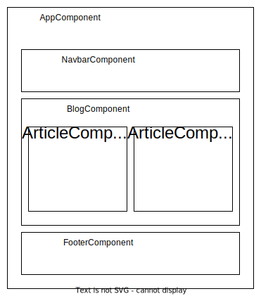

# Récapitulatif Angular

## 1. Contexte et vocabulaire

* Angular est un **framework** : un "cadre de travail", une boîte à outils, permettant de créer des applications **front-end**, web et mobile.
* Pour rappel, la partie front-end concerne tout ce qui est visible par l'utilisateur : l'aspect de l'interface, et toutes les interactions qu'elle permet
* Angular permet de faciliter le développement d'applications complexes, dans le sens où il encourage l'adoption de principes qu'on retrouvera dans toutes les applications Angular.
* Des développeurs ayant travaillé sur d'autres projets Angular n'auront donc pas de difficulté à travailler sur un nouveau projet.
* Angular se réfère aux versions 2 et ultérieures, tandis qu'AngularJS désigne les versions antérieures (jusqu'à 1.6.x)

## 2. Principes

* Angular repose sur une "brique élémentaire" : le **composant**. Une application est formée d'une hiérarchie de composants : des "boîtes" imbriquées les unes dans les autres, et réutilisables (voir schéma ci-dessous, représentant une application de blog très simplifiée)
* Les composants peuvent transmettre des données à des composants situés "en-dessous" dans la hiérarchie
* Les données peuvent également être situées en-dehors des composants, dans des classes TypeScript prévues à cet effet : les **services**.



## 3. Initialisation

### 3.1. Angular CLI

* Angular CLI est l'outil qui permet de générer une nouvelle application, de nouveaux fichiers (composants, services), de démarrer l'application, etc.
* Pré-requis : avoir installé [Node.js](https://nodejs.org), incluant l'outil de gestion de "paquets" `npm` (**Node Package Manager**), sur son poste de travail.
* Pour **installer** la "CLI" (_Command-Line Interface_) d'Angular sur un nouveau poste de travail : `npm install -g @angular/cli`
* Après cette opération, on peut lancer, de n'importe quel terminal (PowerShell, Invite de commandes, ou Git Bash) la commande : `ng`, qui fournit de nombreuses "sous-commandes"

### 3.2. Initialiser un nouveau projet

Pour initialiser un nouveau projet (nommé ici `project-name`) :

```
ng new project-name
```

La commande pose plusieurs questions :

* `? Would you like to add Angular routing? (y/N)` &rarr; répondre **Y** si vous souhaitez gérer la **navigation** (_routing_), ce qui sera souvent le cas (sauf pour des applications très simples)
* `? Which stylesheet format would you like to use?` &rarr; répondre **CSS** sauf si vous connaissez et souhaitez utiliser un "préprocesseur" CSS

Elle se termine sur l'affichage des fichiers générés (tronqué ici), et un message indiquant que les "packages" sont en cours d'installation (ce qui peut prendre du temps) :

```
CREATE angular-recap-app/README.md (1061 bytes)
CREATE angular-recap-app/.editorconfig (274 bytes)
CREATE angular-recap-app/.gitignore (620 bytes)
CREATE angular-recap-app/angular.json (3105 bytes)
CREATE angular-recap-app/package.json (1081 bytes)
...
✔ Packages installed successfully.
```

> Une application de démo a été publiée sur GitHub à cette adresse : <https://github.com/bhubr/angular-recap-app>

### 3.3. Démarrer l'application

Deux commandes strictement équivalentes :

```
ng serve
```

Ou :

```
npm start
```

Cette dernière est un "script" défini dans `package.json`, qui appelle `ng serve`.

**Dans tous les cas**, après un petit délai de lancement, l'application sera accessible via l'URL <http://localhost:4200>.
 
## 4. Composants

La page [Introduction to components and templates](https://angular.io/guide/architecture-components) de la doc officielle est une bonne référence sur ce sujet.

### 4.1. Création d'un nouveau composant

* Pour initialiser un nouveau composant (nommé ici `some-component`) : `ng generate component some-component --skip-tests`, qui peut être abrégé en `ng g c some-component --skip-tests`.
* `--skip-tests` évite de générer le fichier de tests (notion qui dépasse le cadre de ce cours, mais qui demeure importante dans le développement d'applications professionnelles)
* La commande précédente génère 3 fichiers :

    * un fichier `.html` : le **template**, contenant les balises HTML que le composant doit afficher
    * un fichier `.ts` : la classe TypeScript contenant la logique qui dirige le comportement du composant (parfois appelée **contrôleur**, bien que ce soit un terme un peu obsolète, issu de l'ancien AngularJS).
    * un fichier `.css` : la **feuille de style** spécifique au composant (les styles déclarés dans ce fichier n'affecteront pas d'autres composants)
* En plus de cela, elle modifie le fichier `app.module.ts` pour y référencer le composant qui vient d'être généré (indispensable pour qu'on puisse l'utiliser)

### 4.2. Anatomie d'un composant

Dans l'application `angular-recap-app`, on a lancé la commande : `ng g c blog --skip-tests`.

Après cela, on a effectué un _commit_ Git.

> Voici l'adresse de ce commit sur GitHub, où apparaissent toutes les différences par rapport à l'état précédent de l'application : <https://github.com/bhubr/angular-recap-app/commit/696d16f907fb1ac4b7a780e74740206881196629>

À noter : le fichier `.css` généré est initialement vide.

Le fichier template `.html` contient ce contenu temporaire :

```html
<p>blog works!</p>
```

Le fichier `.ts` contient ceci :

```typescript
import { Component, OnInit } from '@angular/core';

@Component({
  selector: 'app-blog',
  templateUrl: './blog.component.html',
  styleUrls: ['./blog.component.css']
})
export class BlogComponent implements OnInit {

  constructor() { }

  ngOnInit(): void {
  }

}
```

Il faut noter :

* Le **sélecteur** `selector`, qui servira pour "appeler" (afficher) le composant depuis un autre composant : `app-blog`.
* L'URL du fichier template, `templateUrl`, qui indique l'emplacement du fichier `.html`.
* Les URL des feuilles de styles, `styleUrls` : c'est un tableau, il peut donc y avoir plusieurs fichiers `.css`.

Dans le corps du composant :

* Le constructeur est pour l'instant vide.
* `ngOnInit()` est une méthode appelée juste après que le composant ait été inséré dans la page.

### 4.3. Exemple

Pour "appeler" ce composant depuis le composant principal, on supprime tout le contenu de `src/app/app.component.html`, on le remplace par ceci (notez que ceci correspond au sélecteur mentionné ci-dessus) :

```html
<app-blog></app-blog>
```

> Le commit correspondant est [ici](https://github.com/bhubr/angular-recap-app/commit/6a7aff4e762cbe5b2fa1928420ccdaefa69030cb) (le code ajouté ci-dessus est tout en bas de la page).

### 4.4. Interpolation et bindings

Angular permet d'"injecter" des "expressions" à l'intérieur d'un template HTML. C'est ce qu'on appelle l'interpolation.

### 4.4.1. Expression simple 

Ce premier exemple affichera `Two plus two is 4` :

```html
<p>Two plus two is {{ 2 + 2 }}</p>
```

### 4.4.2. Attribut (de la classe TS)

Le plus souvent, à l'intérieur des doubles accolades, on injectera la valeur d'un **attribut** défini dans la classe TypeScript.

Si on ajoute ceci à l'intérieur de la classe `BlogComponent`, juste au-dessus du `constructor` :

```typescript
title = 'My personal blog';
```

Et qu'on ajoute cette paire de balises dans le template correspondant :

```html
<h2>{{ title }}</h2>
```

Alors le titre `My personal blog` s'affichera dans un titre `h2`.

### 4.4.3. Attribut (d'une balise HTML)

On peut utiliser cette syntaxe également pour donner une valeur à un attribut d'une balise HTML. Si on ajoute au fichier `.ts` :

```typescript
imageUrl = 'https://angular.io/assets/images/logos/angular/angular.svg';
```

Et au fichier `.html` :

```html

```

On obtiendra l'affichage du logo d'Angular.

**Généralement**, pour les attributs de balise, on préférera cette syntaxe (l'autre reste très utilisée pour le contenu _entre deux balises_) :

```html

```

On appelle ceci un _binding_ ou "liaison" : la valeur de l'attribut `src` de la balise est _liée_ à celle de l'attribut `imageUrl` dans la classe TS.

> Le commit correspondant à l'ajout du titre et de l'image se trouve [ici](https://github.com/bhubr/angular-recap-app/commit/2ad5faa8b9993482a174782479295d6091a7fc79). 

## 4.5. Rendu conditionnel

Le rendu conditionnel consiste à afficher un élément si une condition est remplie. Par exemple, ajoutons ceci dans `BlogComponent`, sous les attributs `title` et `imageUrl`. C'est un booléen qui indique si l'application est en train de charger des données (même si c'est factice pour l'instant).

```typescript
isLoading = true;
```

Dans la méthode `ngOnInit`, ajoutons cette ligne qui va faire passer ce booléen à `false` après 2 secondes :

```typescript
setTimeout(() => { this.isLoading = false; }, 2000);
```

Remplaçons _tout le contenu_ du template `blog.component.html` par ceci :

```html
<p *ngIf="isLoading">Loading data, please wait!</p>
<div *ngIf="!isLoading">
  <h2>{{ title }}</h2>
  
</div>
```

Le paragraphe `Loading data, please wait!` va s'afficher immédiatement au rechargement de l'application. Puis, après deux secondes, c'est la `div` juste en-dessous qui va s'afficher.

> Lr code ci-dessus est dans [ce commit](https://github.com/bhubr/angular-recap-app/commit/ba035e42d3b674ad7033a0e1b98f358cec8c43f2).

C'est la directive `*ngIf` qui permet de réaliser cela, en fonction d'une condition. Cela marche avec d'autres données que des booléens : si on indique une valeur non-booléenne, celle-ci va être convertie implicitement en booléen (on dit parfois _castée_). Les valeurs `0`, `''` (chaîne vide), `NaN`, `null` et `undefined` seront équivalentes à `false`, les autres valeurs à `true`.


## 4.6. Répétition

Un cas omniprésent dans les applications web : répéter des éléments. Le plus souvent, on va charger, depuis une "API", un tableau (exemples avec l'[API GitHub](https://api.github.com/users) et l'[API Pokémon](https://pokeapi.co/api/v2/pokemon/)).

On va donc répéter certains composants pour refléter ces données (par exemple, afficher autant de "cards" qu'on a d'utilisateurs ou de pokémons dans un tableau).

Commençons par ajouter à la partie TypeScript du composant `BlogComponent`, **au-dessus** du décorateur `@Component`, le typage d'un objet "post", représentant un article de blog :

```typescript
interface Post {
  id: number;
  title: string;
  body: string
}
```

Notez qu'on aurait pu utiliser une classe (mot-clé `class`) ou un type (mot-clé `type`). Une interface est suffisante si on n'a pas besoin d'ajouter de _méthodes_ à notre type.

Puis _dans_ la classe  `BlogComponent`, ajoutons un 4ème attribut, `posts` :

```typescript
posts: Post[] = [
  {
    id: 1,
    title: 'sunt aut facere repellat',
    body: 'quia et suscipit\nsuscipit recusandae',
  },
  {
    id: 2,
    title: 'qui est esse',
    body: 'est rerum tempore vitae\nsequi sint nihil',
  },
];
```

Enfin, dans le template, ajoutons ces lignes sous l'image (vous noterez, dans le commit, qu'on a limité la hauteur de cette dernière, afin que les articles soient visibles) :

```html
<article *ngFor="let post of posts">
  <h3>{{ post.title }}</h3>
  <p>{{ post.body }}</p>
</article>
```

C'est la directive `*ngFor` qui permet de répéter un élément (que ce soit une **balise HTML5** classique, comme ici `article`, ou un **composant** Angular).

Ici, `let post of posts` signifie qu'on déclare une variable "locale" `post`, qui va prendre successivement comme valeur _chacun des objets contenus dans `posts`_. Cette variable n'est valable qu'à l'intérieur du bloc délimité par les balises `article`. On peut alors accéder aux attributs `title` et `body` d'un objet `Post` à la fois.

> Le commit est [ici](https://github.com/bhubr/angular-recap-app/commit/48d2544c8e9ebd7374cc237c26506c1dbca7ecf7).

## 4.7. Passage de données entre composants

Dans l'exemple précédent, le bloc délimité par les balises `article` pourrait très bien devenir un composant à part entière. Cela deviendra particulièrement intéressant si on souhaite le réutiliser ailleurs dans l'application.

C'est donc ce que nous allons faire. Pour le générer : `ng g c post-card --skip-tests`.

Nous allons ensuite _couper_ le bloc `<article>...</article>` de `blog.component.html`, le coller dans `post-card.component.html`, et **enlever** le `*ngFor` :

```html
<article>
  <h3>{{ post.title }}</h3>
  <p>{{ post.body }}</p>
</article>
```

À l'endroit où il se trouvait dans `blog.component.html`, on va écrire ceci, qui permet :

* de répéter le composant `app-post-card`,
* de lui _passer une "propriété"_ nommée `post` dont la valeur (à droite du `=`) est la "variable locale" `post` créée par `*ngFor`.

```html
<app-post-card
  *ngFor="let post of posts"
  [post]="post"
></app-post-card>
```

**Si on en reste là**, on hérite d'une erreur :

    src/app/blog/blog.component.html:8:5 - error NG8002: Can't bind to 'post' since it isn't a known property of 'app-post-card'.

C'est dû au fait qu'on passe une donnée nommée `post`, qu'on n'a pas déclarée préalablement.

Il faut :

* Déplacer l'interface `Post` dans un fichier à part (par exemple `src/app/types.ts`) et de là, l'exporter.
* L'importer depuis les composants `BlogComponent` et `PostCardComponent`.
* Déclarer un attribut `post` de type `Post` dans `PostCardComponent`.

On ne montre ici que le code dans `PostCardComponent`, dont on ne montre que les parties modifiées :

```typescript
import { Component, OnInit, Input } from '@angular/core';
import { Post } from '../types';

@Component({ /* ... caché ... */ })
export class PostCardComponent implements OnInit {
  @Input() post!: Post;

  // ... caché ...
}
```

En bref :

* On a importé le "décorateur" `Input`,
* On a également importé l'interface `Post`,
* On utilise le décorateur `Input` pour spécifier que `post` est un attribut "spécial" : sa valeur n'est pas donnée _dans cette classe_, elle est _passée depuis le composant parent_.
* Le `!` permet de "relâcher" les contrôles de TypeScript. On lui "assure" que `post` aura toujours une valeur &mdash; autrement dit, qu'on va **toujours** bien passer la valeur depuis le composant parent.

> Le reste du code modifié est visible sur [ce commit](https://github.com/bhubr/angular-recap-app/commit/08cd89962a08cdbe2d1408c204947eb397efadcb).
